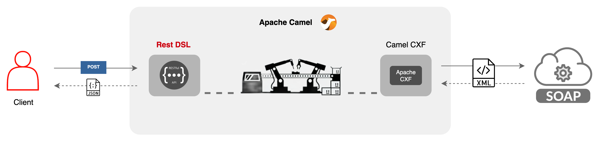

# Camel REST DSL
One way to expose a RESTful API with Apache Camel is to use the REST DSL.<br>
REST DSL is quite easy to use and it is a good choice for simple RESTful APIs.

## What to expect from this example?



Using camel REST DSL, we will expose two RESTful API endpoints to convert a number to words and dollars.
The Number Conversion implementation is provided by a public SOAP Web Service.<br>
To describe it simple, we're **transforming a SOAP Web Service to a RESTful API**.<br>
Instead of creating Java objects to represent the REST API response, we used the generated POJOs from the WSDL file.<br>
- E.g. `NumberToWordsResponse` and `NumberToDollarsResponse` are generated from the WSDL file and 
  used as response objects.

## API Reference

### Convert number to words

```http
  POST /api/convert-number-to-words
```
#### Request Data: 

| Parameter | Type     | Description                  | Required Type   |
| :-------- | :------- |:-----------------------------|:----------------|
| `number`  | `string` | Number to convert to words   |**Required**.    |

Example Request:
`
{
  "number": "123"
}
`
#### Response Data:
| Parameter             | Type     | Description               |
|:----------------------| :------- |:--------------------------|
| `numberToWordsResult` | `string` | Converted numer to words. |

Example Response:
`
{
  "numberToWordsResult": "one hundred and twenty three"
}
`

### Convert number to dollars

```http
  POST /api/convert-number-to-dollars
```
#### Request Data:

| Parameter | Type     | Description                  | Required Type   |
| :-------- | :------- |:-----------------------------|:----------------|
| `number`  | `string` | Number to convert to dollars |**Required**.    |

Example Request:
`
{
  "number": "123"
}
`
#### Response Data:
| Parameter              | Type     | Description                 |
|:-----------------------| :------- |:----------------------------|
| `numberToDollarsResult`| `string` | Converted numer to dollars. |

Example Response:
`
{
  "numberToDollarsResult": "one hundred and twenty three dollars"
}
`

### API Documentation

You can find the API documentation in the JSON format at 
[http://localhost:8080/api-docs](http://localhost:8080/api-docs).<br>
For yaml format, you can use [http://localhost:8080/api-docs.yaml](http://localhost:8080/api-docs.yaml)

## Run Locally

Clone the project

```bash
  git clone
```

Go to the project directory

```bash
  cd camel-cxf-examples/camel-rest-dsl
```

Build the project

```bash
  mvn clean install
```

Start the server

```bash
  mvn spring-boot:run
```

## More about Camel Exception Handling

You can find more about Exception Handling in the [Exception Clause ](https://arc.net/l/quote/vbvfntgf) chapter.
