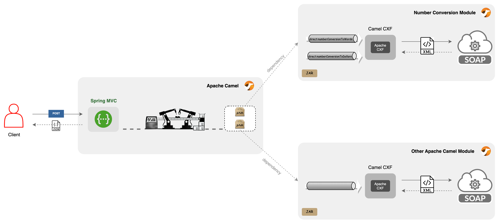

# Orchestrator Application 

This is the orchestrator application for the modular example. 
It is a simple web application that uses the module/s to execute the business logic.

# Architecture 
## Overview
The orchestrator application exposes a RESTful API (using Spring MVC) and integrate with the 
number-conversion-module to convert a number to a word.<br>
The number-conversion-module holds the implementation on how call the SOAP service with Camel CXF.


## API Reference
### Convert number to words

```http
  POST /api/orchestrator/convertNumberToWords
```
#### Request Data:

| Parameter | Type     | Description                  | Required Type   |
| :-------- | :------- |:-----------------------------|:----------------|
| `number`  | `string` | Number to convert to words   |**Required**.    |

Example Request:
`
{
"number": "123"
}
`
#### Response Data:
| Parameter                | Type     | Description                                                                    |
|:-------------------------| :------- |:-------------------------------------------------------------------------------|
| `inputNumber`            | `string` | Given input                                                                    |
| `numberToWordsResult`    | `string` | Converted number to words                                                      |
| `numberToDollarsResult`  | `string` | Converted number to dollars. <br/>`null` in this case for convertNumberToWords |

Example Response:
`
{
    "inputNumber": "123",
    "numberToWordsResult": "one hundred and twenty three ",
    "numberToDollarsResult": null
}
`

### Convert number to dollars

```http
  POST /api/orchestrator/convertNumberToDollars
```
#### Request Data:

| Parameter | Type     | Description                  | Required Type   |
| :-------- | :------- |:-----------------------------|:----------------|
| `number`  | `string` | Number to convert to dollars |**Required**.    |

Example Request:
`
{
    "number": "123"
}
`
#### Response Data:
| Parameter                | Type     | Description                                                                    |
|:-------------------------| :------- |:-------------------------------------------------------------------------------|
| `inputNumber`            | `string` | Given input                                                                    |
| `numberToWordsResult`    | `string` | Converted number to words. <br/>`null` in this case for convertNumberToDollars |
| `numberToDollarsResult`  | `string` | Converted number to dollars.                                                   |

Example Response:
`
{
    "inputNumber": "123",
    "numberToWordsResult": null,
    "numberToDollarsResult": "one hundred and twenty three dollars"
}
`

## Details
To add the number-conversion-module to the orchestrator application, we need to add the following dependency 
to the pom.xml file:
```xml
    <dependency>
        <groupId>com.redhat.example</groupId>
        <artifactId>number-conversion-module</artifactId>
        <version>1.0.0-SNAPSHOT</version>
    </dependency>
```
You also need to register the module's beans in the application context.<br>
To do that, the `ApplicationConfig` was added:
```java
@Configuration
@ComponentScan(basePackages = 
        {
                "org.example.module.orchestrator",
                "org.example.module.numberconversion"  // <-- add the module's beans
        })
public class ApplicationConfig {
}
```
And finally, register module's routes in the `CamelConfig` class:
```java
 @Bean
    public RouteBuilder routeBuilder() {
        return new RouteBuilder() {
            @Override
            public void configure() throws Exception {
                camelContext.addRoutes(new NumberToWordsConversionRoute());
                camelContext.addRoutes(new NumberToDollarsConversionRoute());
            }
        };
    }
```

## Run Locally

Clone the project

```bash
  git clone
```

Go to the project directory

```bash
  cd modular-example/orchestrator-app
```

Build the project

```bash
  mvn clean install
```

Start the server

```bash
  mvn spring-boot:run
```


